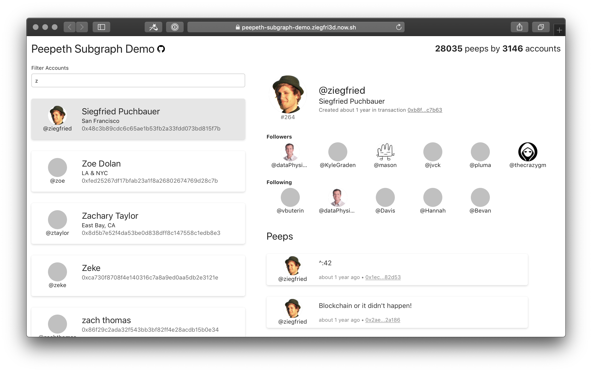

# Peepeth Subgraph

This [subgraph](https://thegraph.com/explorer/subgraph/ziegfried/peepeth) sources events from [Peepeth](https://peepeth.com), the the blockchain-powered social network.

## Example query

```graphql
{
  # 5 lastest peeps
  peeps(first: 5, orderBy: number, orderDirection: desc) {
    number
    content
    timestamp
    # Get some account info from the author of the peep
    account {
      name
      realName
    }
    # Get message this peep is sharing
    share {
      content
      account {
        name
        realName
      }
    }
  }
  # Get total number of accounts and peeps on Peepeth
  peepeth(id: "global") {
    numberOfPeeps
    numberOfAccounts
  }
}
```

## Demo App

Check out the demo app, which uses the subgraph to show some Peepeth accounts, their followers and peeps.

See it live here: [https://peepeth-subgraph.sigi.dev/](https://peepeth-subgraph.sigi.dev/)

<div align="center">
     
</div>

Find the sources and some more info in the [/demo-app](/demo-app) folder

## How Peepeth works

For a high-level overview see [https://peepeth.com/how](https://peepeth.com/how).

Basically peepeth uses a [stateless smart contract](https://medium.com/@childsmaidment/stateless-smart-contracts-21830b0cd1b6) where (arguments to) method calls point to JSON blobs on IPFS. The transaction is submitted and signed by the user.

```
  Ethereum Tx                      IPFS File
+---------------------+          +----------------------------+
| createAccount(      |          |{                           |
|   name: "Hugo",     |          |  "realName": "Hugo Foobar",|
|   ipfsHash: "Qm..." +--------->+  "location": "Somewhere",  |
| )                   |          |  ...                       |
+---------------------+          |}                           |
                                 +----------------------------+
```

Most actions can be performed this way, see [ABI](abis/Contract.json) for details. Some actions do not have corresponding JSON data in IPFS (follow/unfollow for example).

### Batched actions

To reduce cost, Peepeth allows the user to batch a number of actions and submit them at once. In this case the ethereum function call points to a JSON blob in IPFS that contains a list of actions (which can in turn point to JSON blobs in IPFS).

```
   Ethereum Tx             IPFS File 1
+-------------------+    +--------------------------------+       IPFS File 2
|saveBatch(         |    |{                               |     +---------------------------+
|  ipfsHash: "Qm..X"+--->+  "batchSaveJSON": [            |     |{                          |
|)                  |    |    { "follow": { "followee": "0|     |  "type": "peep",          |
+-------------------+    |    { "peep": { "ipfs": "Qm...J"+---->+  "content": "hello world",|
                         |  ]                             |     |  ...                      |
                         |}                               |     |}                          |
                         +--------------------------------+     +---------------------------+
```

### Signed actions

See

- [https://peepeth.com/a/free](https://peepeth.com/a/free)
- [https://medium.com/coinmonks/evolution-of-decentralised-social-media-dfe567d23e54](https://medium.com/coinmonks/evolution-of-decentralised-social-media-dfe567d23e54)

Basically allows users to perform actions for free. User sign action(s) and a central service submits signed batches for all users to the blockchain.

Similar to regular batch, signed actions are stored in JSON documents on IPFS, pointing to other IPFS hashes. The user creates a signature of the IPFS hash of the actual action document using ethereum-style elliptic curve cryptography (`eth_sign`).

## Subgraph Schema

### Account

An account is a peepeth user, bound to an ethereum wallet

<table>
<thead>
<tr>
<th align="left">Field</th>
<th align="right">Argument</th>
<th align="left">Type</th>
<th align="left">Description</th>
</tr>
</thead>
<tbody>
<tr>
<td colspan="2" valign="top"><strong>id</strong></td>
<td valign="top"><a href="#id">ID</a>!</td>
<td>

The account ID is the ethereum wallet address of the user

</td>
</tr>
<tr>
<td colspan="2" valign="top"><strong>number</strong></td>
<td valign="top"><a href="#int">Int</a>!</td>
<td>

Accounts are numbered in the order they were created

</td>
</tr>
<tr>
<td colspan="2" valign="top"><strong>name</strong></td>
<td valign="top"><a href="#string">String</a>!</td>
<td>

The username

</td>
</tr>
<tr>
<td colspan="2" valign="top"><strong>ipfsHash</strong></td>
<td valign="top"><a href="#string">String</a>!</td>
<td>

IPFS of the account info

</td>
</tr>
<tr>
<td colspan="2" valign="top"><strong>info</strong></td>
<td valign="top"><a href="#string">String</a></td>
<td>

Tagline of the user

</td>
</tr>
<tr>
<td colspan="2" valign="top"><strong>website</strong></td>
<td valign="top"><a href="#string">String</a></td>
<td>

The users website

</td>
</tr>
<tr>
<td colspan="2" valign="top"><strong>location</strong></td>
<td valign="top"><a href="#string">String</a></td>
<td>

Geographical location of the user (not in a particular format)

</td>
</tr>
<tr>
<td colspan="2" valign="top"><strong>realName</strong></td>
<td valign="top"><a href="#string">String</a></td>
<td>

The users real name

</td>
</tr>
<tr>
<td colspan="2" valign="top"><strong>avatarUrl</strong></td>
<td valign="top"><a href="#string">String</a></td>
<td>

User avatar image

</td>
</tr>
<tr>
<td colspan="2" valign="top"><strong>backgroundUrl</strong></td>
<td valign="top"><a href="#string">String</a></td>
<td>

User background image

</td>
</tr>
<tr>
<td colspan="2" valign="top"><strong>messageToWorld</strong></td>
<td valign="top"><a href="#string">String</a></td>
<td>

Shout it out there

</td>
</tr>
<tr>
<td colspan="2" valign="top"><strong>followers</strong></td>
<td valign="top">[<a href="#follower">Follower</a>!]!</td>
<td>

List of followers of this user, for example

```
followers {
  account {
    name
  }
}
```

</td>
</tr>
<tr>
<td colspan="2" valign="top"><strong>following</strong></td>
<td valign="top">[<a href="#follower">Follower</a>!]!</td>
<td>

List of peepeth this account is following, for example

```

following {
  followee {
    name
  }
}

```

</td>
</tr>
<tr>
<td colspan="2" valign="top"><strong>peeps</strong></td>
<td valign="top">[<a href="#peep">Peep</a>!]!</td>
<td>

List of peeps by this account

</td>
</tr>
<tr>
<td colspan="2" valign="top"><strong>createdInBlock</strong></td>
<td valign="top"><a href="#int">Int</a>!</td>
<td>

Number of the ethereum block this account was created in

</td>
</tr>
<tr>
<td colspan="2" valign="top"><strong>createdInTx</strong></td>
<td valign="top"><a href="#bytes">Bytes</a>!</td>
<td>

Hash of the ethereum transation this account was created in

</td>
</tr>
<tr>
<td colspan="2" valign="top"><strong>createdTimestamp</strong></td>
<td valign="top"><a href="#int">Int</a>!</td>
<td>

Timestamp of the transaction this account was created in

</td>
</tr>
<tr>
<td colspan="2" valign="top"><strong>updatedInBlock</strong></td>
<td valign="top"><a href="#int">Int</a></td>
<td>

Number of the ethereum block this account was last updated in

</td>
</tr>
<tr>
<td colspan="2" valign="top"><strong>updatedInTx</strong></td>
<td valign="top"><a href="#bytes">Bytes</a></td>
<td>

Hash of the ethereum transaction this account was last updated in

</td>
</tr>
<tr>
<td colspan="2" valign="top"><strong>updatedTimestamp</strong></td>
<td valign="top"><a href="#int">Int</a></td>
<td>

Timestamp of the transaction this account was last updated in

</td>
</tr>
</tbody>
</table>

### Follower

A follower connects two accounts in a directed fashion.
It persists the information of an account following an followee-account.

<table>
<thead>
<tr>
<th align="left">Field</th>
<th align="right">Argument</th>
<th align="left">Type</th>
<th align="left">Description</th>
</tr>
</thead>
<tbody>
<tr>
<td colspan="2" valign="top"><strong>id</strong></td>
<td valign="top"><a href="#id">ID</a>!</td>
<td>

A combination of the two account IDs

</td>
</tr>
<tr>
<td colspan="2" valign="top"><strong>followee</strong></td>
<td valign="top"><a href="#account">Account</a>!</td>
<td>

The account being followed

</td>
</tr>
<tr>
<td colspan="2" valign="top"><strong>account</strong></td>
<td valign="top"><a href="#account">Account</a>!</td>
<td>

The account that is following

</td>
</tr>
<tr>
<td colspan="2" valign="top"><strong>timestamp</strong></td>
<td valign="top"><a href="#int">Int</a>!</td>
<td>

Timestamp when the follow action occurred

</td>
</tr>
<tr>
<td colspan="2" valign="top"><strong>createdInBlock</strong></td>
<td valign="top"><a href="#int">Int</a>!</td>
<td>

Number of the ethereum block this follow action ocurred

</td>
</tr>
<tr>
<td colspan="2" valign="top"><strong>createdInTx</strong></td>
<td valign="top"><a href="#bytes">Bytes</a>!</td>
<td>

Hash of the ethereum transaction this follow action ocurred

</td>
</tr>
<tr>
<td colspan="2" valign="top"><strong>createdTimestamp</strong></td>
<td valign="top"><a href="#int">Int</a>!</td>
<td>

Timestamp of the transaction this follow action ocurred

</td>
</tr>
</tbody>
</table>

### Peep

A post made on the Peepeth social network

<table>
<thead>
<tr>
<th align="left">Field</th>
<th align="right">Argument</th>
<th align="left">Type</th>
<th align="left">Description</th>
</tr>
</thead>
<tbody>
<tr>
<td colspan="2" valign="top"><strong>id</strong></td>
<td valign="top"><a href="#id">ID</a>!</td>
<td>

The Peep ID is the IPFS hash from where the data was retrieved

</td>
</tr>
<tr>
<td colspan="2" valign="top"><strong>number</strong></td>
<td valign="top"><a href="#int">Int</a>!</td>
<td>

Peeps are numbered in the order they are processed

</td>
</tr>
<tr>
<td colspan="2" valign="top"><strong>type</strong></td>
<td valign="top"><a href="#peeptype">PeepType</a>!</td>
<td>

Type of the peep, allows to distinguish between regular peeps,
peeps that share another peep, and replies to other peeps

</td>
</tr>
<tr>
<td colspan="2" valign="top"><strong>content</strong></td>
<td valign="top"><a href="#string">String</a>!</td>
<td>

The content (message) of the peep

</td>
</tr>
<tr>
<td colspan="2" valign="top"><strong>pic</strong></td>
<td valign="top"><a href="#string">String</a></td>
<td>

A picture associated to the peep

</td>
</tr>
<tr>
<td colspan="2" valign="top"><strong>account</strong></td>
<td valign="top"><a href="#account">Account</a></td>
<td>

The author of the peep

</td>
</tr>
<tr>
<td colspan="2" valign="top"><strong>timestamp</strong></td>
<td valign="top"><a href="#int">Int</a>!</td>
<td>

Timestamp when the peep was created

</td>
</tr>
<tr>
<td colspan="2" valign="top"><strong>share</strong></td>
<td valign="top"><a href="#peep">Peep</a></td>
<td>

The peep shared by this peep. This is null in case this is not of type=SHARE

</td>
</tr>
<tr>
<td colspan="2" valign="top"><strong>replyTo</strong></td>
<td valign="top"><a href="#peep">Peep</a></td>
<td>

The peep which this peep is the reply to. Thi is null in case this is not of type=REPLY

</td>
</tr>
<tr>
<td colspan="2" valign="top"><strong>replies</strong></td>
<td valign="top">[<a href="#peep">Peep</a>!]!</td>
<td>

List of all reply-peeps to this peep

</td>
</tr>
<tr>
<td colspan="2" valign="top"><strong>createdInBlock</strong></td>
<td valign="top"><a href="#int">Int</a>!</td>
<td>

Number of the ethereum block this peep was created in

</td>
</tr>
<tr>
<td colspan="2" valign="top"><strong>createdInTx</strong></td>
<td valign="top"><a href="#bytes">Bytes</a>!</td>
<td>

Hash of the ethereum transation this peep was created in

</td>
</tr>
<tr>
<td colspan="2" valign="top"><strong>createdTimestamp</strong></td>
<td valign="top"><a href="#int">Int</a>!</td>
<td>

Timestamp of the transaction this peep was created in

</td>
</tr>
</tbody>
</table>

### Peepeth

Global stats about Peepeth, use Peepeth(id: "global")

<table>
<thead>
<tr>
<th align="left">Field</th>
<th align="right">Argument</th>
<th align="left">Type</th>
<th align="left">Description</th>
</tr>
</thead>
<tbody>
<tr>
<td colspan="2" valign="top"><strong>id</strong></td>
<td valign="top"><a href="#id">ID</a>!</td>
<td>

There is only one entry with `id: "global"`

</td>
</tr>
<tr>
<td colspan="2" valign="top"><strong>numberOfAccounts</strong></td>
<td valign="top"><a href="#int">Int</a>!</td>
<td>

Total number of Peepeth accounts

</td>
</tr>
<tr>
<td colspan="2" valign="top"><strong>numberOfPeeps</strong></td>
<td valign="top"><a href="#int">Int</a>!</td>
<td>

Total number of peeps

</td>
</tr>
<tr>
<td colspan="2" valign="top"><strong>numberOfPeepsNotFound</strong></td>
<td valign="top"><a href="#int">Int</a>!</td>
<td>

Number of peeps where the data in IPFS could not be located

</td>
</tr>
</tbody>
</table>

## Enums

### PeepType

Type of a peep to distinguish replies, shared peeps and regular peeps

<table>
<thead>
<th align="left">Value</th>
<th align="left">Description</th>
</thead>
<tbody>
<tr>
<td valign="top"><strong>PEEP</strong></td>
<td>

A regular peep

</td>
</tr>
<tr>
<td valign="top"><strong>SHARE</strong></td>
<td>

A peep sharing another peep

</td>
</tr>
<tr>
<td valign="top"><strong>REPLY</strong></td>
<td>

A peep as a reply to another peep

</td>
</tr>
</tbody>
</table>

## Known issues

- Not not all peeps, accounts, followers are recorded correctly by the subgraph in cases when IPFS reads time out: [graph-node issue](https://github.com/graphprotocol/graph-node/issues/963)
- Signatures from signed actions are currently not verified, since there is no easy way to perform this in assembly script: [graph-ts issue](https://github.com/graphprotocol/graph-ts/issues/63)
- `changeName` actions are currently ignored due to some transactions in mainnet causing the subgraph to crash: [graph-node issue](https://github.com/graphprotocol/graph-node/issues/932)
